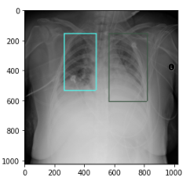
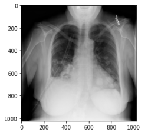
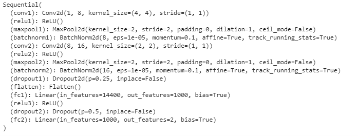
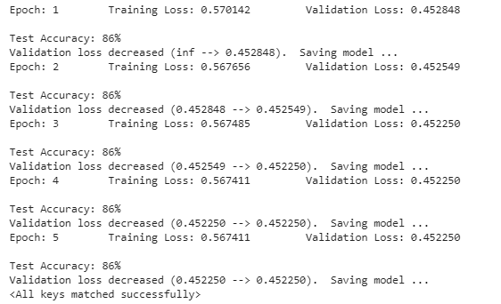

# RSNA Pneumonia Classification

## Introduction

Through this project, I will use the RSNA Pneumonia dataset provided by Kaggle to classify whether a patient is infected or not.

You can check all the details about the competition <a href = 'https://www.kaggle.com/c/rsna-pneumonia-detection-challenge/overview' > here </a>.

Also, you can check the visualization section I used from this <a href = 'https://www.kaggle.com/umerfarooq807/exploratory-data-analysis' > kernel </a>

It is important to mention that the competition was mainly about the RSNA Pneumonia detection but, I used the data for the classification purpose.

## Sample Images

Infected

Healthy

## CNN Architecture

I used ReLU as the activation function, dropout to prevent overfitting and BatchNormalization which, after doing some research,
turned out to help in enhancing the performance with similar datasets.

Also, I used the crossEntropyLoss as the loss function, which includes the Softmax activation function within its implementation.
And finally, I used Adam Optimizer with 0.001 as the learning rate.

## Results

I used Google Colab for training. So, I had to train the model for 5 epochs and save the parameters and then, load the parameters 
and continue for another 5 epochs. The data needed a lot of Ram and Disk and I did that to avoid the crashing problem.

Accuracy is not always a good indicator in these cases but this was just the start to get a glance at working with such a dataset!

## Next Steps

This is just the start and there is a lot more to be done to increase the performance. We can increase the performance by:

• Training the model for more than 15 epoch.

• Using a deeper network.

• Applying any of the weight loss techniques to avoid the problem of the class imbalance.

• Using Transfer Learning.

## Medium Article

You can check more details about the exact steps through this <a href = 'https://medium.com/@MustafaAwny/rsna-pneumonia-classification-efc9f20f92a3' > article <a/>